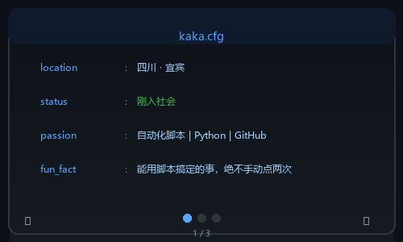

  

---

## 🧑‍💻 About Me

  

---

## 🛠️ Tech Stack

  
  
  
  
  

---

## 📊 GitHub Stats

  
  

  

---

## 🏆 GitHub Trophies

  

---

## 📈 Activity Graph

  

---

## 🐍 Contribution Snake

  <picture>
    <source media="(prefers-color-scheme: dark)" srcset="https://raw.githubusercontent.com/kaka-niu/kaka-niu/output/github-contribution-grid-snake-dark.svg" />
    <source media="(prefers-color-scheme: light)" srcset="https://raw.githubusercontent.com/kaka-niu/kaka-niu/output/github-contribution-grid-snake.svg" />
    
  </picture>

---

## 📬 Find Me

  

---

  <i>⚡ 每小时自动更新</i>
    
  

